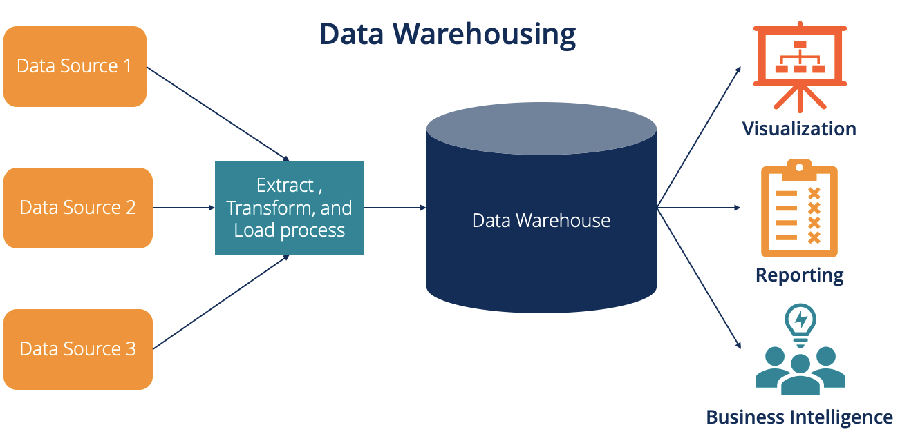

# **Data Engineering Fundamentals**

## **Types of Data**

### **Structured**

- Definition: Data that is organized in a defined manner or schema, typically
found in relational databases.
- Characteristics: Easily queryable, organized in rows and columns and has a
consistent structure
- Examples: Database tables, CSV files with consistent columns and Excel
spreadsheets.

### **Unstructured Data**

- Definition: Data that doesn't have a predefined structure or schema.
- Characteristics: Not easily queryable without preprocessing and may come in
various formats
- Examples: Text files without a fixed format, videos and audio files, images
and emails and word processing documents.

### **Semi-Structured Data**

- Definition: Data that is not as organized as structured data but has some
level of structure in the form of tags, hierarchies or other patterns.
- Characteristics: Elements might be tagged or categorized in some way. More flexible than structured data but not as chaotic as unstructured data.
- Examples: XML and JSON files and log files with varied formats.

### **Big Data 5 V`s**

- Volume: large amount of data to be stored and processed, with scales ranging from terabytes to zettabytes.
- Speed: large amount of data generated, generally, in a short space of time.
- Variety: great variety of data, because, within the large volume of data, we have different types, such as structured data, stored in databases, sequenced in tables, etc. Semi-structured data has heterogeneous patterns. Unstructured data which is, for example, images and audio.
- Veracity: data that matches the reality of the moment. Past data cannot be considered true at the time it is analyzed.
- Value: the richer the data, the more important it is to know how to ask the right questions at the beginning of the analysis process.

### **Data Warehouse**

- Definition: A centralized repository optimized for analysis where data from
different sources is stored in a structured format.
- Characteristics:
    - Designed for complex queries and analysis.
    - Data is cleaned, transformed, and loaded (ETL process).
    - Typically uses a star or snowflake schema.
    - Optimized for read-heavy operations
- Examples: Amazon Redshift, Google BigQuery and Microsoft Azure SQL Data
Warehouse.

<figure markdown="span">
  { width="800" }
</figure>

### **Data Lake**

- Definition: A storage repository that holds vast amounts of raw data in its
native format, including structured, semi-structured and unstructured data.
- Characteristics:
    - Can store large volumes of raw data without predefined schema.
    - Data is loaded as-is, no need for preprocessing.
    - Supports batch, real-time, and stream processing.
    - Can be queried for data transformation or exploration purposes
- Examples: Amazon s3 when usend as data lake, Azure Data Lake Storage and HDFS.

### **Comparing the two**

<table>
  <thead>
    <tr>
      <th>Comparing</th>
      <th>Data Warehouse</th>
      <th>Data Lake</th>
    </tr>
  </thead>
  <tbody>
    <tr>
      <td>Schema</td>
      <td>Schema-on-write: predefined schema before writing data (ETL)</td>
      <td>Schema-on-read: schema is defined at the time of reading data (ELT)</td>
    </tr>
    <tr>
      <td>Data Types</td>
      <td>Primarily structured data</td>
      <td>Structured and unstructured data</td>
    </tr>
    <tr>
      <td>Agility</td>
      <td>Less agile due to predefined schema</td>
      <td>More agile as it accepts raw data without a predefined structure</td>
    </tr>
    <tr>
      <td>Processing</td>
      <td>ETL (Extract, Transform, Load)</td>
      <td>(Extract, Load, Transform) or just Load for storage purposes</td>
    </tr>
    <tr>
      <td>Cost</td>
      <td>Typically more expensive because of optimizations for complex queries</td>
      <td>Cost-effective storage solutions, but costs can rise when processing large amounts of data</td>
    </tr>
  </tbody>
</table>

### **Choosing a Warehouse vs. a Lake**

Use a Data Warehouse when:

- You have structured data sources and require fast and complex queries.
- Data integration from different sources is essential.
- Business intelligence and analytics are the primary use cases.

Use a Data Lake when:

- You have a mix of structured, semi-structured, or unstructured data.
- You need a scalable and cost-effective solution to store massive amounts of
data.
- Future needs for data are uncertain, and you want flexibility in storage and
processing.
- Advanced analytics, machine learning, or data discovery are key goals.

!!! note

    Often, organizations use a combination of both, ingesting raw data into a
    data lake and then processing and moving refined data into a data warehouse
    for analysis.
