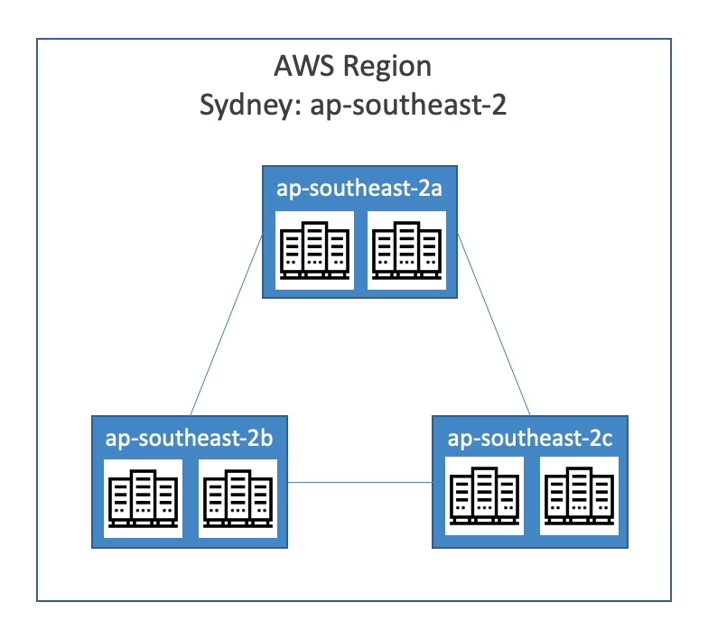

# **Cloud AWS**

## **Introdução à AWS**

A AWS (Amazon Web Services) é um dos provedores de nuvem mais utilizados no mundo. Sua trajetória pode ser resumida da seguinte forma:

- 2002: A Amazon começou a usar sua infraestrutura de nuvem internamente.
- 2003: Com o sucesso de sua infraestrutura, surgiu a ideia de oferecer seus serviços ao mercado.
- 2004: Foi lançado o AWS SQS (Simple Queue Service), marcando o início da oferta de serviços para o público.
- 2006: A AWS expandiu sua oferta com o lançamento do S3 (Simple Storage Service) e EC2 (Elastic Compute Cloud).
- Atualmente: A AWS é líder global entre os provedores de nuvem, atendendo a milhões de clientes em diversos setores.

## **Infraestrutura Global da AWS**

### AWS Regiões
As regiões da AWS são locais físicos onde a AWS opera clusters de data centers,
identificadas por nomes como **us-east-1** e **eu-west-3**.

!!! question "Pergunta"

    Ao escolher uma região para lançar um aplicativo, por exemplo, deve ser
    considerado os seguintes fatores:

    - Conformidade legal e governança de dados: Os dados não saem da região sem sua
    permissão explícita.
    - Proximidade dos clientes: Menor latência ao acessar os serviços.
    - Serviços disponíveis na região: Nem todos os serviços e recursos estão
    disponíveis em todas as regiões.
    - Preços: Os custos variam entre regiões e podem ser consultados na página de
    preços dos serviços.

### AWS Zonas de Disponibilidadae

Cada região da AWS possui de 3 a 6 Zonas de Disponibilidade (Availability Zones).
Cada zona é composta por um ou mais data centers, projetados com redundância em
energia, rede e conectividade.

Essa estrutura garante alta disponibilidade e resiliência: se uma zona de
disponibilidade for afetada por um desastre natural, a aplicação permanece
operacional devido à redundância da infraestrutura física.

<!-- { width="300" height="300" .shadow} -->

<figure markdown="span">
  { width="400" height="400" }
  <figcaption>Zonas de Disponibilidade AWS</figcaption>
</figure>

### AWS Edge Locations / Points of Presence

A AWS possui mais de 400 Points of Presence, compostos por Edge Locations e
Regional Caches, distribuídos em mais de 90 cidades e 40 países.

Esses pontos permitem a entrega de conteúdo aos usuários finais com menor
latência, garantindo desempenho mais rápido e eficiente.
