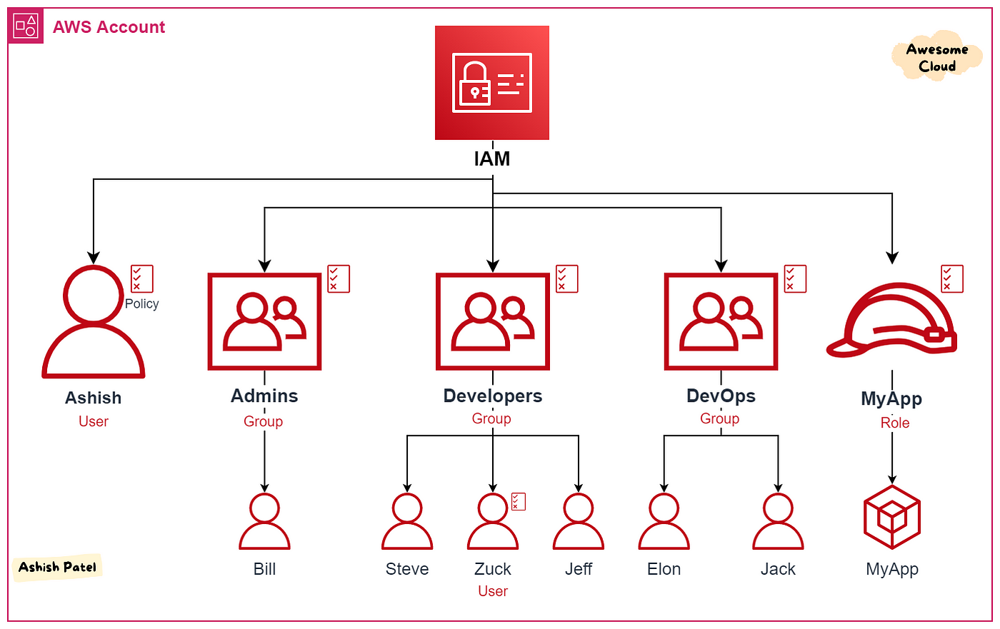

# **AWS IAM**

## **IAM: Usuários e Grupos**

O serviço de Identidade e Gerenciamento de Acesso (IAM) é global e permite criar `usuários` e `grupos` para controle de permissões.

A conta `root`, criada por padrão, não deve ser usada nem compartilhada.

Usuários são membros da organização e podem ser agrupados para receber as mesmas permissões. Grupos só podem conter usuários, não outros grupos.

Um usuário pode estar em vários grupos ou não pertencer a nenhum.

<figure markdown="span">
  { width="800" }
</figure>

## **IAM: Permissões**

As permissões de usuários e grupos são dadas em documentos JSON chamados de `policies`.

Exemplo de uma policie AWS que concede permissões de leitura em um bucket S3:

```json
{
  "Version": "2012-10-17",
  "Statement": [
    {
      "Effect": "Allow",
      "Action": [
        "s3:GetObject",
        "s3:ListBucket"
      ],
      "Resource": [
        "arn:aws:s3:::example-bucket",
        "arn:aws:s3:::example-bucket/*"
      ]
    }
  ]
}
```

- "Version": "2012-10-17": Define a versão do documento de política.
- "Effect": "Allow": Concede permissão para as ações especificadas.
- "Action": Lista as ações permitidas (neste caso, s3:GetObject e s3:ListBucket).
- "Resource": Define os recursos para os quais a política é válida, incluindo o bucket e seus objetos.

!!! Info "Importante"

    Na AWS, deve-se aplicar o princípio do privilégio mínimo, ou seja, conceder apenas as permissões estritamente necessárias ao usuário.   